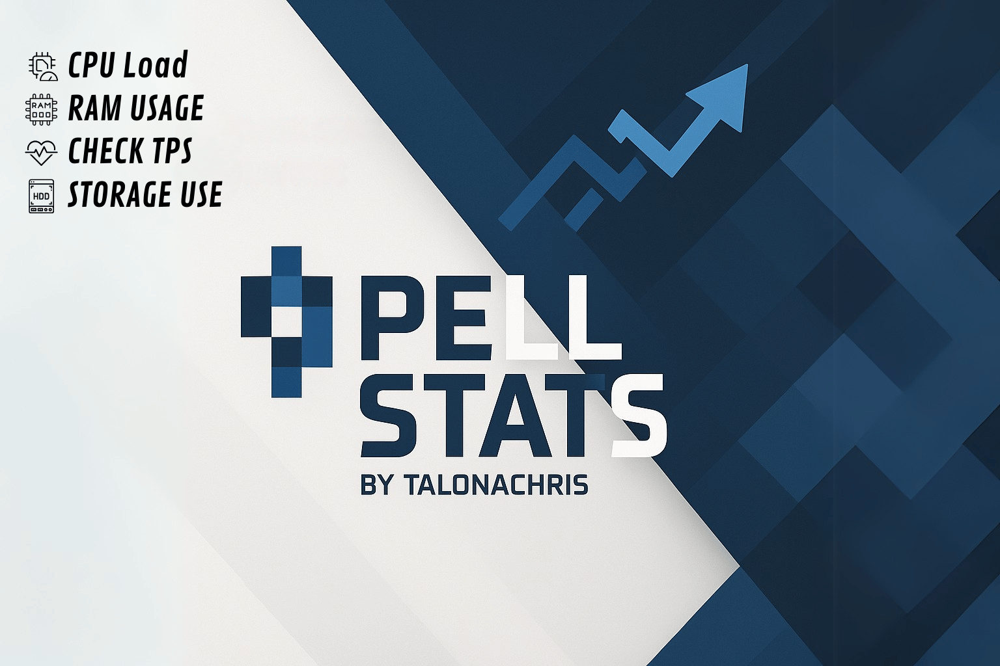

---

## 🇬🇧 **English Version**

# ✨ PellStats – Your Spigot Server Monitor ✨

Keep essential server statistics at your fingertips — right in-game!

---

## 🚀 Features

- Display **RAM usage** in real time  
- Track **CPU usage**  
- Monitor current **Server TPS**  
- Query **Storage usage**  
- Show **plugin version** and **GitHub link**  

---

## 🎮 Commands & Permissions

| 📝 Command        | 🎯 Alias  | 🔒 Permission         | 📖 Description                            |
|-------------------|-----------|-----------------------|-------------------------------------------|
| `/pellram`        | `psr`     | `pellstats.ram`       | Displays current RAM usage                |
| `/pellcpu`        | `psc`     | `pellstats.cpu`       | Displays current CPU usage                |
| `/pelltps`        | `pstps`   | `pellstats.tps`       | Displays server TPS                       |
| `/pellstorage`    | `pss`     | `pellstats.storage`   | Displays used storage                     |
| `/pellinfo`       | `psi`     | —                     | Shows plugin version                      |
| `/pellgit`        | `psgit`   | —                     | Shows the plugin’s GitHub link            |

---

## ⚠️ Important Notice

I developed **PellStats** as my very first coding project.  
It may contain bugs or unexpected behavior — feel free to report any issues!

Happy monitoring! 🎉

---

## 🇩🇪 **Deutsche Version**

# ✨ PellStats – Dein Spigot-Server-Monitor ✨

Behalte wichtige Server-Statistiken im Blick — direkt ingame!

---

## 🚀 Features

- **RAM-Nutzung** in Echtzeit anzeigen  
- **CPU-Auslastung** tracken  
- Aktuelle **Server-TPS** überwachen  
- **Speichernutzung** abfragen  
- Plugin-Version und GitHub-Link anzeigen  

---

## 🎮 Commands & Permissions

| 📝 Command        | 🎯 Alias  | 🔒 Permission         | 📖 Beschreibung                            |
|-------------------|-----------|-----------------------|-------------------------------------------|
| `/pellram`        | `psr`     | `pellstats.ram`       | Zeigt die aktuelle RAM-Nutzung             |
| `/pellcpu`        | `psc`     | `pellstats.cpu`       | Zeigt die CPU-Auslastung                   |
| `/pelltps`        | `pstps`   | `pellstats.tps`       | Zeigt die Server-TPS                       |
| `/pellstorage`    | `pss`     | `pellstats.storage`   | Zeigt den genutzten Speicher               |
| `/pellinfo`       | `psi`     | —                     | Zeigt die Plugin-Version                   |
| `/pellgit`        | `psgit`   | —                     | Zeigt den GitHub-Link des Plugins          |

---

## ⚠️ Wichtiger Hinweis

Ich habe **PellStats** selbst als mein erstes Coding-Projekt entwickelt.  
Es kann daher noch zu Bugs oder unerwartetem Verhalten kommen — Bug-Reports sind sehr willkommen!

Happy monitoring! 🎉

